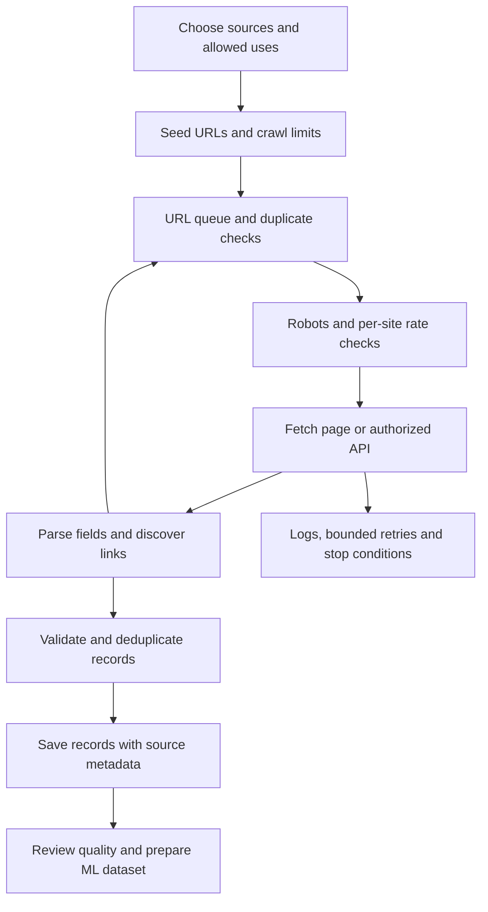

# Learn web scraping for ML: a focused YouTube path

Researched on **24 September 2026**. Assumptions: English videos, Python, beginner at scraping, and a preference for understanding how things work before scaling up.

**My recommendation: use freeCodeCamp's Beautiful Soup course as your introduction, then its Scrapy course as your main practical course.** Add the short robots.txt video, a compliance talk, an architecture walkthrough, and two China-specific explainers. No single video I found reliably covers your entire request.

Start with video 1 below today. Then complete video 2 and video 3 before collecting data from a real third-party website.

Related findings:

- [US versus mainland China: what actually changes](REGIONAL_SCRAPING_GUIDE.md)
- [Verification, source notes, and alternatives considered](RESOURCE_RESEARCH_NOTES.md)

## Watch in this order

Runtimes and publication dates below come from YouTube page metadata checked during this research. These are direct video links, not search-result links.

| Order | Video and creator | Runtime / published | Why it earns a place |
|---|---|---|---|
| 1 | [Web Scraping with Python — Beautiful Soup Crash Course](https://www.youtube.com/watch?v=XVv6mJpFOb0) — freeCodeCamp / JimShapedCoding | 1:08:23 · 18 Nov 2020 | Best starting point in this selection: HTML, inspecting elements, fetching pages, extracting fields, and saving output. |
| 2 | [How Robots.txt Works](https://www.youtube.com/watch?v=IXNEVt9rZG8) — Google Search Central / Martin Splitt | 5:55 · 4 Dec 2024 | A short explanation from Google of crawl directives and how they differ from indexing directives. |
| 3 | [A Step By Step Guide To Assessing Your Web Scraping Compliance](https://www.youtube.com/watch?v=oUbXTegNFBs) — Zyte / Sanaea Daruwalla | 35:44 · 6 Nov 2023 | A structured way to consider what you collect, from where, and for what purpose. |
| 4 | [Scrapy Course — Python Web Scraping for Beginners](https://www.youtube.com/watch?v=mBoX_JCKZTE) — freeCodeCamp / Joe Kearney | 4:37:09 · 27 Apr 2023 | Main practical course: project structure, following links, extracting records, cleaning, storage, and deployment. Start with the first 2:04:33. |
| 5 | [Playwright Web Scraping Tutorial for Beginners (2026)](https://www.youtube.com/watch?v=OrMYaPfKDcs) — Oxylabs | 13:18 · 10 Mar 2026 | Adds browser automation for pages that load data using JavaScript. A supplement, not a full course. |
| 6 | [Design a Web Crawler System Design Interview w/ a Ex-Meta Staff Engineer](https://www.youtube.com/watch?v=krsuaUp__pM) — Hello Interview / Evan King | 1:05:04 · 16 Jun 2024 | Explains the bigger system: requirements, data flow, and design tradeoffs. Watch after building a small scraper. |
| 7 | [How to speed up your web traffic inside Mainland China](https://www.youtube.com/watch?v=ARGhSwiSWdg) — Cloudflare / Jess Liu | 2:41 · 14 Mar 2025 | Brief infrastructure context: regional caching, DNS, and cross-border access. |
| 8 | [Data protection in China: The Personal Information Protection Law enters into force](https://www.youtube.com/watch?v=05kNnZty3j8) — Cuatrecasas | 40:15 · 2 Nov 2021 | Lawyer-led introduction to China's PIPL. Useful foundations, but must be paired with the newer official references in the regional guide. |

**Time:** all eight videos total about **8 hours 28 minutes**. Using only the recommended first 2:04:33 of Scrapy brings this to about **5 hours 55 minutes**, before practice and any skipped sections. Plan several sessions; completion time with exercises will be longer.

**Optional follow-up:** [Balancing Innovation and Regulation in Web Scraping — Sanaea Daruwalla](https://www.youtube.com/watch?v=NJ63ygS7LJY), Extract Summit, **24:44**, published **8 Oct 2025**. This adds a later discussion of legal cases and AI-related issues. It is a 2025 snapshot, not a complete statement of law in September 2026.

## What to watch closely, and what each resource leaves out

### 1. Beautiful Soup: understand a single page

Prioritize the sections starting at **00:00** (HTML), **12:41** (finding elements), **16:22** (browser inspection), **24:48** (Requests), and **1:01:53** (saving results). Beautiful Soup parses HTML; Requests retrieves it. Being able to explain those separate jobs is your first milestone.

**Checkpoint:** from a local HTML file, extract a title, price, and link, then explain which selector chose each field.

**Limit:** the course is older. Its live example site and selectors may have changed. Use a local fixture or a site explicitly intended for scraping practice rather than assuming every example still works. It does not cover production architecture or regional law.

### 2. Robots.txt: learn the vocabulary before crawling

Watch the whole video. **02:47** is especially useful for understanding `noindex` versus `disallow`.

`https://example.com/robots.txt` contains crawler directives. `User-agent` identifies which crawler a group addresses; `Disallow` and `Allow` describe paths. It is **not authentication, a security barrier, or a licence to reuse content**. A missing file does not grant permission to train on everything. `noindex` concerns search indexing, not a general permission to collect or train. The normative reference is [RFC 9309](https://www.rfc-editor.org/rfc/rfc9309.html).

Illustrative rules:

```text
User-agent: *
Disallow: /private/
Disallow: /account/
Allow: /public/
```

**Checkpoint:** explain why `/account/` should be excluded by your crawler even if a request technically succeeds. Do not infer from `/public/` that copyright or privacy restrictions disappear.

**Limit:** Google's indexing behavior is not a complete specification for your custom scraper. Use a robots parser, and consult the RFC for matching, caching, redirects, and fetch failures. `Crawl-delay` is not standardized by RFC 9309; impose your own conservative rate limits too.

### 3. Compliance: separate access from reuse

Watch this before practicing on real sites. The [speaker's companion explanation](https://www.scraping.club/p/assessing-legal-compliance-of-web-scraping) and the [official conference archive](https://www.extractsummit.io/talks) corroborate the topic and speaker.

**Checkpoint:** write a short source assessment: target pages, fields needed, API/export availability, site terms, data licence, personal information, intended ML use, and retention period.

**Limit:** this is a lawyer speaking at a scraping vendor's event. It is useful issue-spotting, with a commercial perspective; it is not country-specific permission for your project. Pair it with the regional guide, and optionally the 2025 update.

### 4. Scrapy: organize the scraper into components

Watch **00:00–2:04:33** first. Useful entry points:

- **16:28:** project structure.
- **28:17:** first spider.
- **55:09:** discovering pages and extracting data.
- **1:20:11:** cleaning records in pipelines.
- **1:44:19:** saving to files and databases.

The [course creator's written guide](https://scrapeops.io/python-scrapy-playbook/freecodecamp-beginner-course/) is useful when a command or dependency differs from the recording.

**Checkpoint:** explain how the spider, scheduler, downloader, and item pipeline cooperate; export a small dataset and run again without accumulating duplicate records.

**What to defer:** **2:04:33–3:18:12** covers user-agent/proxy techniques; it is unnecessary for this beginner exercise. Cloud deployment starts at **3:18:12** and can wait until local collection is reliable. Commercial proxy and hosting services are not prerequisites for the initial lessons. A proxy does not supply permission to access or reuse data.

### 5. Playwright: understand why JavaScript changes extraction

Focus on **00:57** (setup), **01:37** (first scraper), **02:47** (locators), **05:39** (dynamic content), and **10:58** (export). Learn why HTML fetched directly can differ from the rendered page. Use the [official Python documentation](https://playwright.dev/python/docs/library) for current installation details.

**Checkpoint:** on an authorized practice page, explain whether the data exists in the initial HTML, arrives through an API, or appears after browser rendering.

**Limit:** Oxylabs sells scraping products; the description and later sections include proxy/access maintenance material. The short ethics section is insufficient by itself. Skip **09:33–10:58** initially. Do not treat the video's production-readiness language as proof that your own scraper is production-ready.

### 6. Architecture: connect the pieces

Focus on **10:31** (interface and data flow), **14:48** (high-level design), and **18:20** onward (design details). A crawler discovers URLs; a scraper extracts fields. They often live in the same application, but they solve different problems.

**Limit:** this is a system-design interview walkthrough, not a coding course. Large distributed queues and fleets of workers are unnecessary for your first project.

This is a suggested small-project design, adapted from the component responsibilities in [Scrapy's architecture documentation](https://docs.scrapy.org/en/latest/topics/architecture.html):



Start with one process. The important separation is responsibilities, not separate servers.

### 7–8. Regional context: watch together

Cloudflare explains infrastructure from the website operator's perspective; Cuatrecasas explains privacy law. **Neither is a direct US-versus-China scraping tutorial.** Together with the [regional comparison](REGIONAL_SCRAPING_GUIDE.md), they cover the main missing dimensions without pretending that a China networking video answers legal questions.

The China webinar is from 2021. Cross-border transfer procedures changed afterward, including in 2024. Use it for concepts, not current thresholds or filing instructions.

## Apply the videos to an ML data project

Recommended practice plan, rather than another course:

1. Pick a local HTML fixture or an explicitly authorized practice site. [ToScrape](https://toscrape.com/) provides scraping sandboxes. Start with a small page budget.
2. Define a record before writing the scraper: text, source URL, retrieval time in UTC, language, and the permissions/licence reference. If comparing regions, also record request region and observed locale.
3. Add a domain allowlist, duplicate URL checks, conservative per-host pacing, timeouts, and bounded retries. Pause on access denials or challenges; respect `Retry-After` on rate limiting. Ask the operator for an API, export, or permission when needed.
4. Review a sample manually. Count empty fields, duplicates, encoding errors, and unexpected page types. An HTTP 200 response might be an error or challenge page rather than your target content.
5. Deduplicate before splitting data. Keep related or near-identical records together across train/validation/test boundaries; use a time-based split if predicting future outcomes. Record source and regional coverage so collection bias is visible.
6. Decide the ML objective. Supervised training needs an appropriate target/label and evaluation design. For semantic search, clean text can be chunked, embedded, and stored in Milvus; that does not itself train a new model. Keep the permission/provenance metadata associated with every chunk.

You are ready to move on when you can explain every box in the diagram, collect a small permitted dataset reproducibly, account for missing/blocked pages, and explain whether you have permission for the intended ML use.

## How confident is this selection?

The titles, channels, runtimes, publication dates, and published chapters were checked against YouTube metadata. Coverage was evaluated using creator descriptions, course guides, conference materials, and official technical/legal references. **I did not watch every video end to end or execute the tutorial code.** The recommendations are a judgment about fit for your request, not a claim that every lesson was independently tested.
